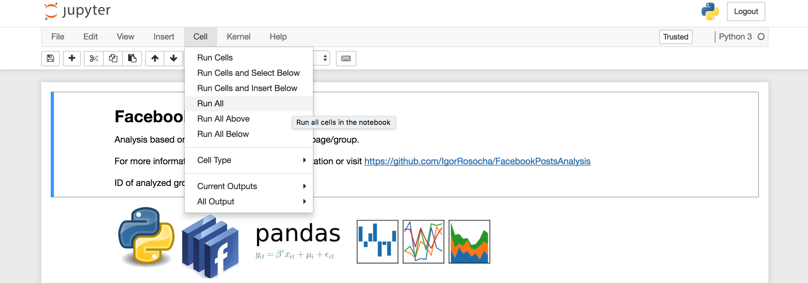

Working with the Jupyter Notebook
==================================

Once the **FacebookPostsAnalysis** has generated the **Jupyter Notebook** file, you can open and run it in a simple way. Just follow these steps:

1. While located in the analysis folder, containing the **.ipynb** file, run the following command:
	
.. code:: python

    jupyter notebook

2. In browser menu, choose the **.ipynb** file of the desired **Facebook** open group/page (based on ID in the file name),

3. In **Jupyter** main menu, select **Cell** and **Run All** (as on the image below),

4. Now you can browse the full analysis of the desired **Facebook** open group/page.

If you wish, you can proceed to the full `API documentation <FacebookPostsAnalysis.html#section>`__.